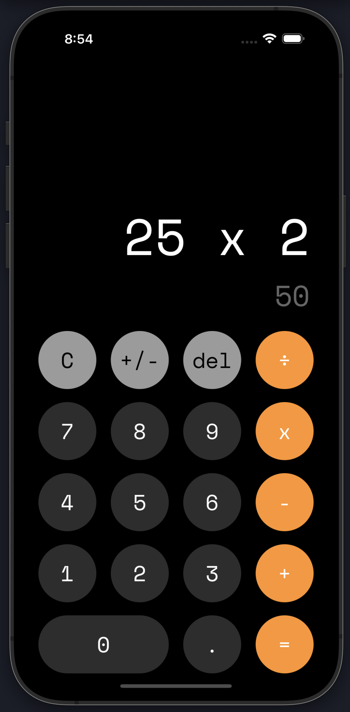

<div align="center">

# Calculator App made in React Native and TypeScript.



</div>

## Get started

1. Install dependencies

    ```bash
    npm i
    ```

2. Start the app

    ```bash
    npm start
    ```

In the output, you'll find options to open the app in a

- [Development build](https://docs.expo.dev/develop/development-builds/introduction/)
- [Android emulator](https://docs.expo.dev/workflow/android-studio-emulator/)
- [iOS simulator](https://docs.expo.dev/workflow/ios-simulator/)
- [Expo Go](https://expo.dev/go), a limited sandbox for trying out app development with Expo


